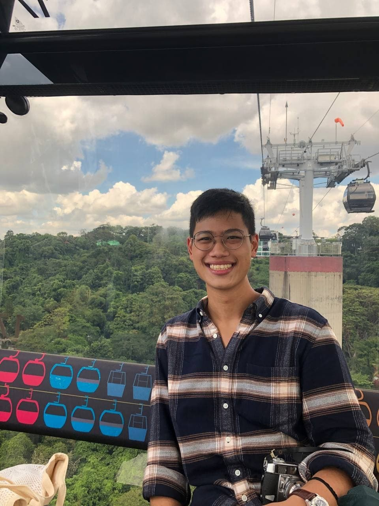
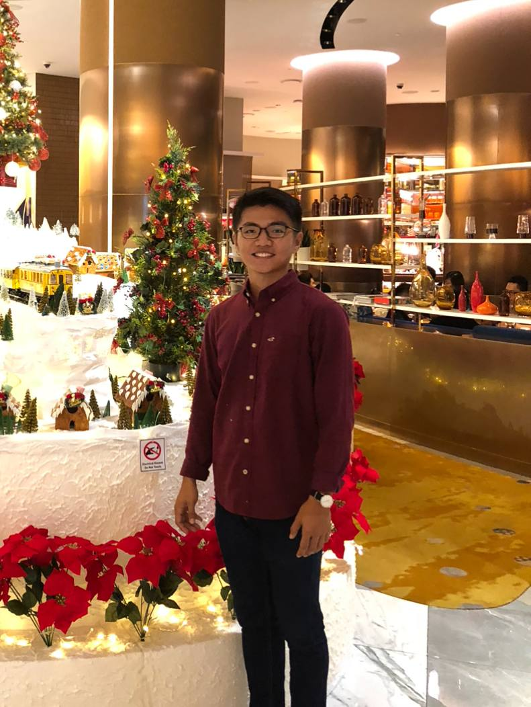
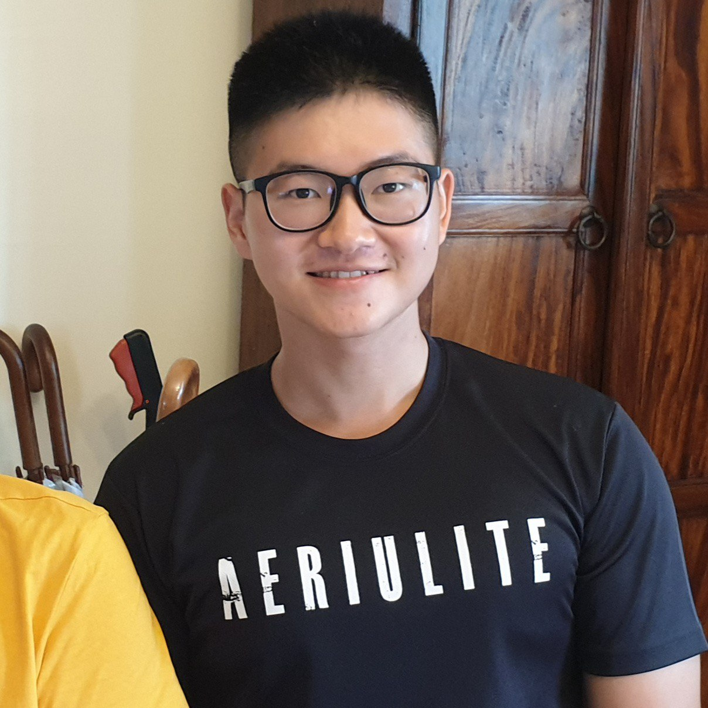

We are a team based in the [School of Computing, National University of Singapore](http://www.comp.nus.edu.sg).

You can reach us at the email `seer[at]comp.nus.edu.sg`

## Project team

### Shurvir Arora

* [[github](http://github.com/shurvirarora)]
* [[portfolio](team/shurvirarora.md)]

* Role: Developer
* Responsibilities: `Logic`, `Model` components.

### Eugene Chia

* [[github](http://github.com/eugenechiaay)]
* [[portfolio](team/eugenechiaay.md)]

* Role: Developer
* Responsibilities: `Logic`, `Storage` components.

### Jia Ming

* [[github](http://github.com/simjm)]
* [[portfolio](team/simjm.md)]

* Role: Developer
* Responsibilities: `Model`, `UI` components.

### Wei En

* [[github](http://github.com/tanweien)]
* [[portfolio](team/tanweien.md)]

* Role: Developer
* Responsibilities: `Logic`, `Testing` components.
