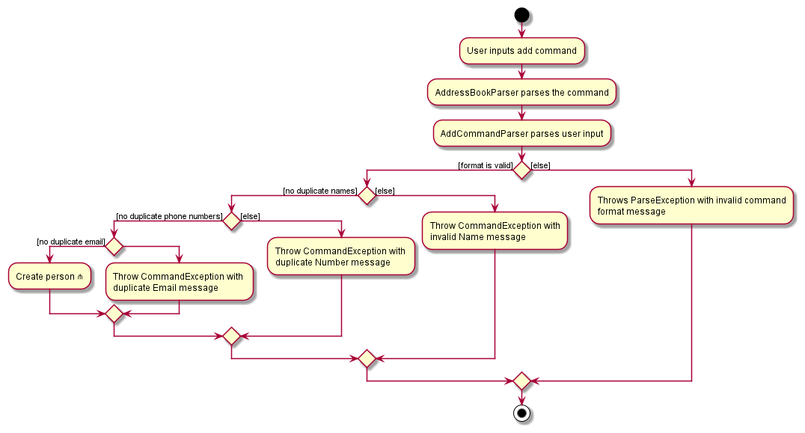
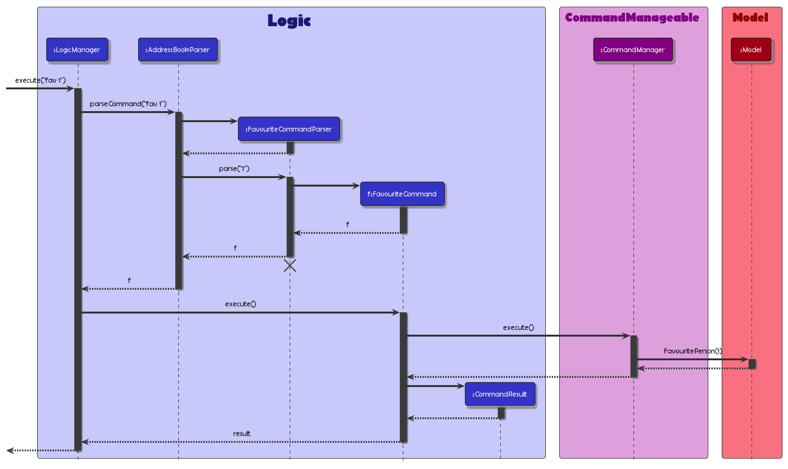
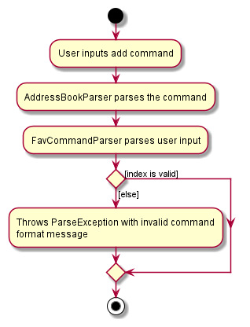
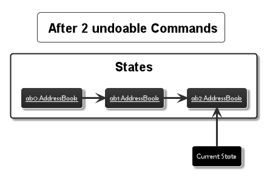
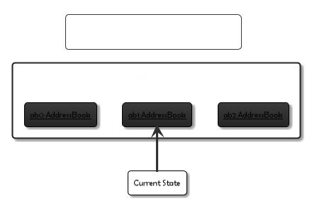
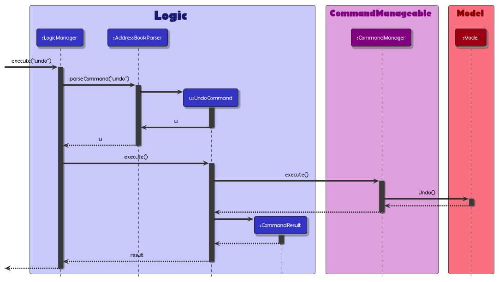
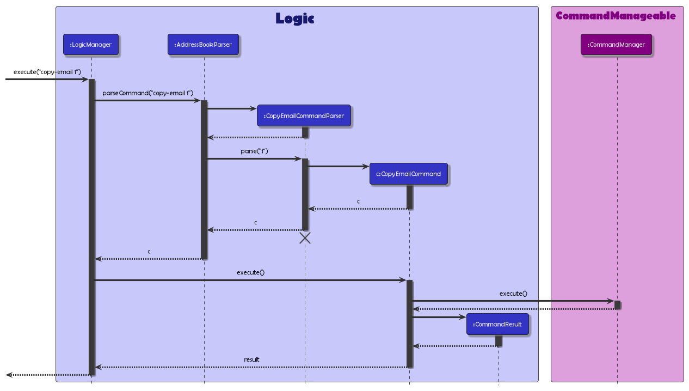

--------------------------------------------------------------------------------------------------------------------

<!-- TABLE OF CONTENTS -->

  
Table of Contents

  <ol>
    <li>
      <a href="#acknowledgements">Acknowledgements</a>
    </li>
    <li>
      <a href="#setting-up-getting-started">Setting up, Getting started</a>
    </li>
    <li>
      <a href="#design">Design</a>
      <ul>
        <li><a href="#architecture">Architecture</a></li>
        <li>
            <a href="#components">Components</a>
            <ul>
                <li><a href="#the-ui-component">UI</a></li>
                <li><a href="#the-logic-component">Logic</a></li>
                <li><a href="#the-commandmanageable-component">Command Manageable</a></li>
                <li><a href="#the-model-component">Model</a></li>
                <li><a href="#the-storage-component">Storage</a></li>
            </ul>
        </li>
        <li><a href="#common-classes">Common classes</a></li>
      </ul>
    </li>
    <li>
        <a href="#implementation">Implementation</a>
        <ul>
            <li><a href="#add-person-feature">Add Person Feature</a></li>
            <li><a href="#favouriteun-favourite-person-feature">Favourite/Un-favourite Person Feature</a></li>
            <li><a href="#find-persons-by-tag-feature">Find Person(s) by Tag Feature</a></li>
            <li><a href="#undoredo-command-feature">Undo/Redo Command Feature</a></li>
            <li><a href="#copy-emailphone-number-feature">Copy Email/Phone Number Feature</a></li>
        </ul>
    </li>
    <li>
        <a href="#documentation-logging-testing-configuration-dev-ops">Documentation, logging, testing, configuration, dev-ops</a>
    </li>
    <li>
        <a href="#appendix">Appendix</a>
        <ul>
            <li><a href="#product-scope">Product Scope</a></li>
            <li><a href="#user-stories">User Stories</a></li>
            <li><a href="#use-cases">Use Cases</a></li>
            <li><a href="#non-functional-requirements">Non-Functional Requirements</a></li>
            <li><a href="#glossary">Glossary</a></li>
        </ul>
    </li>
    <li><a href="#instructions-for-manual-testing">Instructions for manual testing</a></li>
  </ol>

## **Acknowledgements**

* Adapted from [AddressBook3](https://github.com/nus-cs2103-AY2122S2/tp)

___________________________________________________________________________________________________________________

## **Setting up, getting started**

Refer to the guide [_Setting up and getting started_](SettingUp.md).

--------------------------------------------------------------------------------------------------------------------

## Design

> :bulb: **TIP:** The `.puml` files used to create diagrams in this document can be found in the [diagrams](https://github.com/AY2122S2-CS2103T-W11-4/tp/tree/master/docs/diagrams) folder. Refer to the [_PlantUML Tutorial_ at se-edu/guides](https://se-education.org/guides/tutorials/plantUml.html) to learn how to create and edit diagrams.

### Architecture

  
<h5 align="center"> 1.1. Architecture Diagram</h5>

The ***Architecture Diagram*** given above explains the high-level design of the App.

Given below is a quick overview of Main components and how they interact with each other.

**Main components of the architecture**

**`Main`** has two classes called [`Main`](https://github.com/se-edu/addressbook-level3/tree/master/src/main/java/seedu/address/Main.java) and [`MainApp`](https://github.com/se-edu/addressbook-level3/tree/master/src/main/java/seedu/address/MainApp.java). It is responsible for,
* At app launch: Initializes the components in the correct sequence, and connects them up with each other.
* At shut down: Shuts down the components and invokes cleanup methods where necessary.

[**`Commons`**](#common-classes) represents a collection of classes used by multiple other components.

The rest of the App consists of five components.

* [**`UI`**](#ui-component): The UI of the App.
* [**`Logic`**](#logic-component): The command executor.
* [**`Model`**](#model-component): Holds the data of the App in memory.
* [**`Storage`**](#storage-component): Reads data from, and writes data to, the hard disk.
* [`CommandManager`](#command-manager-component): Receives commands from the logic component and handles its execution/un-execution appropriately.

**How the architecture components interact with each other**

The *Sequence Diagram* below shows how the components interact with each other for the scenario where the user issues the command delete 1.

  
<h5 align="center">Architecture Sequence Diagram (Delete command)</h5>

Each of the five main components (also shown in the diagram above),

* defines its *API* in an interface with the same name as the Component.
* implements its functionality using a concrete {Component Name}Manager class (which follows the corresponding API interface mentioned in the previous point.

> :bulb: Eg. The Model component defines its API in the Model.java interface and implements its functionality using the ModelManager.java class which follows the Model interface. Other components interact with a given component through its interface rather than the concrete class (reason: to prevent outside component's being coupled to the implementation of a component), as illustrated in the (partial) class diagram below.

The following section gives more details of each component.

### Components

  
<h5 align="center">Component Managers</h5>

#### **The UI Component**

**API** : [`Ui.java`](https://github.com/se-edu/addressbook-level3/tree/master/src/main/java/seedu/address/ui/Ui.java)

  
<h5 align="center">UI Class Diagram</h5>

The UI consists of a MainWindow that is made up of parts e.g.CommandBox, ResultDisplay, PersonListPanel, StatusBarFooter etc. All these, including the MainWindow, inherit from the abstract UiPart class which captures the commonalities between classes that represent parts of the visible GUI.

The UI component uses the JavaFx UI framework. The layout of these UI parts are defined in matching .fxml files that are in the src/main/resources/view folder. For example, the layout of the [MainWindow](https://github.com/se-edu/addressbook-level3/tree/master/src/main/java/seedu/address/ui/MainWindow.java) is specified in [MainWindow.fxml](https://github.com/se-edu/addressbook-level3/tree/master/src/main/resources/view/MainWindow.fxml)

The UI component,

* executes user commands using the Logic component.
* listens for changes to Model data so that the UI can be updated with the modified data.
* keeps a reference to the Logic component, because the UI relies on the Logic to execute commands.
* depends on some classes in the Model component, as it displays Person object residing in the Model.

> :memo: **NOTE** The Command Manager component is not reflected in the diagram since there are no direct dependencies with the UI component

#### **The Logic Component**

**API** : [`Logic.java`](https://github.com/se-edu/addressbook-level3/tree/master/src/main/java/seedu/address/logic/Logic.java)

Here's a (partial) class diagram of the `Logic` component:

  
<h5 align="center">Logic Class Diagram (Partial)</h5>

How the `Logic` component works:
1. When `Logic` is called upon to execute a command, it uses the `AddressBookParser` class to parse the user command.
1. This results in a `Command` object (more precisely, an object of one of its subclasses e.g., `AddCommand`) which is executed by the `LogicManager`.
1. The command can communicate with the `CommandManager` when it is executed (e.g. to add a person).
1. The result of the command execution is encapsulated as a `CommandResult` object which is returned from `Logic`.

The Sequence Diagram below illustrates the interactions within the `Logic` component for the `execute("delete 1")` API call.

  
<h5 align="center">Delete Command Sequence Diagram</h5>

> :memo: **NOTE:** The lifeline for `DeleteCommandParser` should end at the destroy marker (X) but due to a limitation of PlantUML, the lifeline reaches the end of diagram.

Here are the other classes in `Logic` (omitted from the class diagram above) that are used for parsing a user command:

  
<h5 align="center">Parser Class Diagram</h5>

How the parsing works:
* When called upon to parse a user command, the `AddressBookParser` class creates an `XYZCommandParser` (`XYZ` is a placeholder for the specific command name e.g., `AddCommandParser`) which uses the other classes shown above to parse the user command and create a `XYZCommand` object (e.g., `AddCommand`) which the `AddressBookParser` returns back as a `Command` object.
* All `XYZCommandParser` classes (e.g., `AddCommandParser`, `DeleteCommandParser`, ...) inherit from the `Parser` interface so that they can be treated similarly where possible e.g, during testing.

#### **The CommandManageable Component**

**API** : [`CommandManageable.java`](https://github.com/eugenechiaay/tp/blob/master/src/main/java/seedu/address/logic/commands/CommandManageable.java)

  
<h5 align="center">CM Class Diagram</h5>

The `CommandManageable` component,

* receives command objects from the `Logic` component e.g. a `DeleteCommand`.
* keeps track of commands and states in a stack.
* any `UndoCommand` or `RedoCommand` it receives will be processed differently from other commands.
* a component between logic and model, commands are executed and un-execute here.

> :bulb: **COOL:** The Command Manager component was built as a means to support the newly implemented undo and redo functions!

#### **The Model Component**

**API** : [`Model.java`](https://github.com/se-edu/addressbook-level3/tree/master/src/main/java/seedu/address/model/Model.java)

  
<h5 align="center">Model Class Diagram</h5>

The `Model` component,

* stores the NUSearch data i.e., all `Person` objects (which are contained in a `UniquePersonList` object).
* stores the currently 'selected' `Person` objects (e.g., results of a search query) as a separate _filtered_ list which is exposed to outsiders as an unmodifiable `ObservableList<Person>` that can be 'observed' e.g. the UI can be bound to this list so that the UI automatically updates when the data in the list change.
* stores a `UserPref` object that represents the user’s preferences. This is exposed to the outside as a `ReadOnlyUserPref` objects.
* does not depend on any of the other three components (as the `Model` represents data entities of the domain, they should make sense on their own without depending on other components)

>:memo: **NOTE:** An alternative (arguably, a more OOP) model is given below. It has a `Tag` list in the `AddressBook`, which `Person` references. This allows `AddressBook` to only require one `Tag` object per unique tag, instead of each `Person` needing their own `Tag` objects. 

  
<h5 align="center">Better Model Class Diagram</h5>

#### **The Storage Component**

**API** : [`Storage.java`](https://github.com/se-edu/addressbook-level3/tree/master/src/main/java/seedu/address/storage/Storage.java)

  
<h5 align="center">Storage Class Diagram</h5>

The `Storage` component,
* can save both address book data and user preference data in json format, and read them back into corresponding objects.
* inherits from both `AddressBookStorage` and `UserPrefStorage`, which means it can be treated as either one (if only the functionality of only one is needed).
* depends on some classes in the `Model` component (because the `Storage` component's job is to save/retrieve objects that belong to the `Model`)

### Common classes

Classes used by multiple components are in the `seedu.addressbook.commons` package.

--------------------------------------------------------------------------------------------------------------------

## **Implementation**

### Add Person feature

This section describes how a `Person` object is added to the list of Contacts.

**Implementation**

A `Person` object in NUSearch consists of `Name`, `Phone`, `Faculty`, `Email`, `Role`, `Faculty`, `Tag`, `Telegram`. The latter two fields are Optional fields.
When a `add` command is being input to the command input box, a `Person` will be added to the `UniquePersonsList`.

Here is how an example of how the `add` command behaves:

1. The user inputs - `add n/Shurvir Arora p/92212429 e/hello@gmail.com r/Professor f/Science t/Hello tele/@Shuvy123`.
2. The user's input is received by the `LogicManager` class and passed into the `parseCommand` method of the `AddressBookParser` class.
3. In the `parseCommand` method, the `add` command format is being matched.
5. An `AddCommand` object is created using the user's input as arguments.
6. The `AddCommand` object is then returned to the `LogicManager` class and then passed to the `CommandManager` class.
7. The `AddCommand` is executed in the `CommandManager` class, whereby a `Person` object with the given fields is constructed and added to the `UniquePersonsList`.

**Sequence Diagram**

The given sequence diagram shows the execution of the feature.

  
<h5 align="center">Add Sequence Diagram</h5>

**Activity Diagram**

  
<h5 align="center">Add Activity Diagram</h5>

### Favourite/Un-favourite Person Feature

This section describes how a `Person` object is "favourited" or "Un-favourited".

**Implementation**

Apart from the fields stated above, a `Person` object also has a `Favourite` boolean field to indicate whether a person is a favourite one or not.

Here is how an example of how the `fav` command behaves:

1. The user inputs - `fav 1`.
2. The user's input is received by the `LogicManager` class and passed into the `parseCommand` method of the `AddressBookParser` class.
3. In the `parseCommand` method, the `fav` command format is being matched.
4. A `FavouriteCommand` object is created using the user's input as arguments.
5. The `FavouriteCommand` object is then returned to the `LogicManager` class and then passed to the `CommandManager` class.
6. The `FavouriteCommand` is executed in the `CommandManager` class, whereby a clone of the target `Person` is created, albeit its `Favourite` field set to true.

> The programme behaves in a similar way for  "Unfavourite" command.

**Sequence Diagram**

The given sequence diagram shows the execution of the feature.

  
<h5 align="center">Fav Sequence Diagram</h5>

**Activity Diagram**

  
<h5 align="center">Fav Activity Diagram</h5>

### Find Person(s) by Tag Feature

This section describes how the find by `Tag` feature works.

**Implementation**

The find by`Tag` feature operates through the use of the `Predicate` class. Where a `FilteredPersonsList` is updated using a `Predicate` object.

Here is how an example of how the `tag` command behaves:

1. The user inputs - `tag friends`.
2. The user's input is received by the `LogicManager` class and passed into the `parseCommand` method of the `AddressBookParser` class.
3. In the `parseCommand` method, the `tag` command format is being matched.
4. The user's input is used to create a `Predicate` object. With this `Predicate` object, a `TagCommand` is created.
5. The `TagCommand` object is then returned to the `LogicManager` class and then passed to the `CommandManager` class.
6. The `TagCommand` is executed in the `CommandManager` class, whereby the `FilteredPersonsList` is update with the `Predicate` object.

**Sequence Diagram**

The given sequence diagram shows the execution of the feature.

  
<h5 align="center">Tag Sequence Diagram</h5>

### Undo/Redo Command Feature

This section describes how the Undo/Redo feature works.

**Implementation**

Here is how an example of how the `Undo/Redo` command behaves:

Example starting state with 2 states prior:

  
<h5 align="center">Undo Redo Initial State Diagram</h5>

1. The user inputs - `Undo`.
2. The user's input is received by the `LogicManager` class and passed into the `parseCommand` method of the `AddressBookParser` class.
3. In the `parseCommand` method, the `undo` command format is being matched.
4. An `UndoCommand` is created.
5. The `UndoCommand` object is then returned to the `LogicManager` class and then passed to the `CommandManager` class.
6. The `UndoCommand` is executed in the `CommandManager` class, whereby the state of the `Addressbook` is updated to the previous state.

  
<h5 align="center">Undo Redo State After Redo Diagram</h5>

**Sequence Diagram**

The given sequence diagram shows the execution of the feature.

  
<h5 align="center">Undo Sequence Diagram</h5>

### Copy Email/Phone Number Feature

This section describes how the Copy Email/Phone Number feature works.

**Implementation**

Here is how an example of how the Copy Email/Phone Number command behaves:

1. The user inputs - `copy-email 2`.
2. The user's input is received by the `LogicManager` class and passed into the `parseCommand` method of the `AddressBookParser` class.
3. In the `parseCommand` method, the `copy-email` command format is being matched.
4. A `CopyEmailCommand` command is created.
5. The `CopyEmailCommand` object is then returned to the `LogicManager` class and then passed to the `CommandManager` class.
6. The `CopyEmailCommand` is executed in the `CommandManager` class, whereby the `Email` of a `Person` object at the specified index is copied unto the device's clipboard.

**Sequence Diagram**

The given sequence diagram shows the execution of the feature.

  
<h5 align="center">Copy Email Sequence Diagram</h5>

--------------------------------------------------------------------------------------------------------------------

## **Documentation, logging, testing, configuration, dev-ops**

* [Documentation guide](Documentation.md)
* [Testing guide](Testing.md)
* [Logging guide](Logging.md)
* [Configuration guide](Configuration.md)
* [DevOps guide](DevOps.md)

--------------------------------------------------------------------------------------------------------------------

## **Appendix**

**Requirements**

### Product scope

**Target user profile**:

* Has a need to manage a significant number of contacts
* Prefers desktop apps over other types
* Can type fast
* Prefers typing to mouse interactions
* Is reasonably comfortable using CLI apps

**Value proposition**: manage NUS contacts faster than a typical mouse/GUI driven app

### User stories

Priorities: High (must have) - `* * *`, Medium (nice to have) - `* *`, Low (unlikely to have) - `*`

| Priority | As a …​                                    | I want to …​                                  | So that I can…​                                                             |
|-----| ------------------------------------------ |-----------------------------------------------|-----------------------------------------------------------------------------|
| `* * *` | new user                                   | see usage instructions                        | refer to instructions when I forget how to use the App                      |
| `* * *` | user                                       | add a new staff                               |                                                                             |
| `* * *` | user                                       | delete a staff                                | remove entries that I no longer need                                        |
| `* * *` | user                                       | find a staff by name                          | locate details of staff without having to go through the entire list        |
| `* * *` | user                                       | find a staff by tag                           | locate details of staff associated with the tag without knowing their names |
| `* * *` | user                                       | list all staff contacts                       | view all the staff contacts in NUSearch                                     |
| `* * ` | user                                       | add an existing staff to favourites list      |                                                                             |
| `* * ` | user                                       | delete an existing staff from favourites list |                                                                             |
| `* * ` | user                                       | list all favourite contacts                   | view all my favourite staff contacts                                        |
| `* *` | user                                       | hide private contact details                  | minimize chance of someone else seeing them by accident                     |
| `*` | user with many persons in the address book | sort persons by name                          | locate a person easily                                                      |
| `*` | user                                       | click on hyperlinks on a contact              | contact staff easily                                                        |

*{More to be added}*

### Use cases

(For all use cases below, the **System** is the `NUSearch` and the **Actor** is the `user`, unless specified otherwise)

**Use case 1: Viewing help**

**MSS**

1.  User requests to access the help page
2.  NUSearch shows list of commands and syntax on how to use them

    Use case ends.

**Use case 2: Adding a contact**

**MSS**

1. User requests to add contact to the list
2. NUSearch adds the contact in the database.

    Use case ends.

**Extensions**

* 2a. The given contact exist in the NUSearch database.

    * 2a1. NUSearch shows an error message.

      Use case resumes at step 2.

**Use case 3: Listing all contacts**

**MSS**

1.  User requests to list all contacts.
2.  NUSearch shows a list of contacts.

    Use case ends.

**Extensions**

* 2a. The list is empty.

  Use case ends.

**Use case 4: Locating contacts by name**

**MSS**

1.  User requests to find contacts with name.
2.  NUSearch shows a list of contacts with the name.

    Use case ends.

**Extensions**

* 2a. The given name does not exist in the NUSearch database.

    * 2a1. NUSearch shows an error message.

      Use case resumes at step 2.

**Use case 5: Locate contact by tag**

**MSS**

1.  User requests to list all contacts that contain the specified tag
2.  NUSearch shows a list of contacts

    Use case ends.

**Extensions**

* 2a. The list is empty.

  Use case ends.

**Use case 6: Add contacts to favourites list**

**MSS**

1.  User requests to add a contact to the favourites list
2.  NUSearch shows an updated list of the user's favourite contacts

    Use case ends.

**Extensions**

* 1a. The contact specified does not exist in the system.

  The system prompts the user to key in another contact to be added

**Use case 7: Remove contacts from favourites list**

**MSS**

1.  User requests to remove a contact from the favourites list
2.  NUSearch shows an updated list of the user's favourite contacts

    Use case ends.

**Extensions**

* 1a. The contact specified does not exist in the system.

  The system prompts the user to key in another contact to be added

* 2a. The list is empty.

  Use case ends.

**Use case 8: Listing all favourite contacts**

**MSS**

1.  User requests to list all favourite contacts.
2.  NUSearch shows a list of contacts.

    Use case ends.

**Extensions**

* 2a. The list is empty.

  Use case ends.

**Use case 9: Delete a contact**

**MSS**

1.  User requests to list contacts
2.  NUSearch shows a list of contacts
3.  User requests to delete a specific contact in the list
4.  NUSearch deletes the contact

    Use case ends.

**Extensions**

* 2a. The list is empty.

  Use case ends.

* 3a. The given index is invalid.

    * 3a1. NUSearch shows an error message.

      Use case resumes at step 2.

**Use case 10: Exit the program**

**MSS**

1.  User requests to exit the program
2.  NUSearch says bye

    Use case ends.

### Non-Functional Requirements

1. Should work on any _mainstream OS_ as long as it has Java `11` or above installed.
2. Should be able to hold up to 1000 persons without a noticeable sluggishness in performance for typical usage.
3. A user with above average typing speed for regular English text (i.e. not code, not system admin commands) should be able to accomplish most of the tasks faster using commands than using the mouse.
4. Should be usable by a novice who is unfamiliar with typing commands.
5. Should quickly display requested information within 2 seconds.

*{More to be added}*

### Glossary

* **Mainstream OS**: Windows, Linux, Unix, OS-X
* **Private contact detail**: A contact detail that is not meant to be shared with others
* **Command-line interface**: A command-line interface processes commands to a computer program in the form of lines of text
* **Student**: A student from NUS
* **Staff**: Staff member of NUS, including teaching assistants and administrative staff

--------------------------------------------------------------------------------------------------------------------

## **Instructions for manual testing**

Given below are instructions to test the app manually.

:information_source: **Note:** These instructions only provide a starting point for testers to work on;
testers are expected to do more *exploratory* testing.

### Launch and shutdown

1. Initial launch

    1. Download the jar file and copy into an empty folder

    1. Double-click the jar file Expected: Shows the GUI with a set of sample contacts. The window size may not be optimum.

1. Saving window preferences

    1. Resize the window to an optimum size. Move the window to a different location. Close the window.

    1. Re-launch the app by double-clicking the jar file. 
       Expected: The most recent window size and location is retained.

1. _{ more test cases …​ }_

### Deleting a person

1. Deleting a person while all persons are being shown

    1. Prerequisites: List all persons using the `list` command. Multiple persons in the list.

    1. Test case: `delete 1` 
       Expected: First contact is deleted from the list. Details of the deleted contact shown in the status message. Timestamp in the status bar is updated.

    1. Test case: `delete 0` 
       Expected: No person is deleted. Error details shown in the status message. Status bar remains the same.

    1. Other incorrect delete commands to try: `delete`, `delete x`, `...` (where x is larger than the list size) 
       Expected: Similar to previous.

1. _{ more test cases …​ }_

### Adding a person

1. Adding a person while all persons are being shown

    1. Prerequisites: Person to be added is not a duplicate person.

    1. Test case: `add n/Sim sim e/simsim@gmail.com p/92214993 r/TA f/FASS` 
       Expected: Sim Sim is added.

    1. Other incorrect add commands to try: `add`, `add n/nameWithoutEmailOrPhone`, `...`  
       Expected: Error thrown.

1. _{ more test cases …​ }_

### Saving data

1. Dealing with missing/corrupted data files

    1. _{explain how to simulate a missing/corrupted file, and the expected behavior}_

1. _{ more test cases …​ }_
