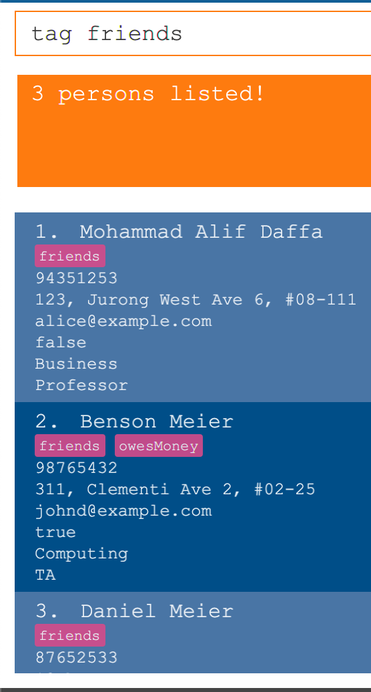

# NUSearch User guide v1.2

NUSearch is a **desktop app for managing NUS staff contacts, optimized for use via a Command Line Interface** (CLI) while still having the benefits of a Graphical User Interface (GUI).  

If you can type fast, NUSearch can get your contact management tasks done faster than traditional GUI apps.

<!-- TABLE OF CONTENTS -->

  
Table of Contents

  <ol>
    <li>
      <a href="#quick-start">Quickstart</a>
    </li>
    <li>
      <a href="#notes-before-use">Notes before use</a>
    </li>
    <li>
      <a href="#commands">Commands</a>
      <ul>
        <li><a href="#view-help--help">View Help</a></li>
        <li><a href="#list-all-contacts--list">List all contacts</a></li>
        <li><a href="#add-a-contact-add-">Add a contact</a></li>
        <li><a href="#edit-a-contact--edit-">Edit a contact</a></li>
        <li><a href="#favourite-a-contact--fav-">Favourite a contact</a></li>
        <li><a href="#un-favourite-a-contact--unfav-">Un-favourite a contact</a></li>
        <li><a href="#list-all-favourite-contacts--list-fav">List all favourite contacts</a></li>
        <li><a href="#find-contacts-by-name--find-">Find contacts by name</a></li>
        <li><a href="#find-contacts-by-tags-tag-">Find contacts by tags</a></li>
        <li><a href="#delete-a-contact--delete-">Delete a contact</a></li>
        <li><a href="#clear-all-entries--clear">Clear all entries</a></li>
        <li><a href="#undo-a-command--undo">Undo a command</a></li>
        <li><a href="#redo-a-command--redo">Redo a command</a></li>
        <li><a href="#exiting-the-program--exit">Exit NUSearch</a></li>
      </ul>
    </li>
    <li>
        <a href="#data-matters">Data matters</a>
        <ul>
            <li><a href="#saving-the-data">Saving the data</a></li>
            <li><a href="#editing-the-data-file">Editing the data file</a></li>
        </ul>
    </li>
    <li>
        <a href="#faq">Frequently asked questions</a>
        <ul>
        </ul>
    </li>
    <li>
        <a href="#command-summary">Command summary</a>
        <ul>
        </ul>
    </li>
  </ol>

## Quick start:

1. Ensure that you have Java `11` or above installed in your Computer.

2. Download the latest `NUSearch.jar` from [here](https://github.com/se-edu/NUSearch/releases).

3. Copy the file to the folder you want to use as the _home folder_ for your NUSearch.

4. Double-click the file to start the app. The GUI (aka Screen) similar to the one below should appear in a few seconds.  

  
  <h5 align="center">Figure 1. NUSearch home page</h5>

5. Type the command in the command box and press Enter to execute it. e.g. typing **`help`** and pressing Enter will open the help window. 
   > Some example commands you can try:
   > * **`list`** : Lists all contacts.
   > * **`add`**`n/John Doe p/98765432 e/johnd@example.com f/Computing a/John street, block 123, #01-01` : Adds a contact named `John Doe` to the NUSearch.
   > * **`delete`**`3` : Deletes the 3rd contact shown in the current list.
   > * **`clear`** : Deletes all contacts.
   > * **`exit`** : Exits the app.
   
_____________________________________________________
## Notes before use:

* Words in `UPPER_CASE` are the parameters to be supplied by the user. 
  e.g. in `add n/NAME`, 
  > `NAME` is a parameter which can be used as `add n/John Doe`.

* Items in square brackets are optional. 
  e.g `n/NAME [tele/USERNAME]`,
  > `[tele/TELEGRAM]` is an optional parameter, hence`n/John Doe tele/@JohnDoe` and  `n/John Doe` are both valid commands.

* Items with `…`​ after them can be used multiple times or not at all (i.e zero times). 
  e.g. `[t/TAG]…​`,
  > `[t/TAG]…​` can be used as ` ` (i.e. 0 times), `t/CS2103T`, `t/CS2103T t/friend` etc.

* Parameters can be in any order. 
  > If the command specifies `n/NAME p/PHONE_NUMBER`, `p/PHONE_NUMBER n/NAME` is also acceptable.

* If a parameter is expected only once in the command but you specified it multiple times, only the last occurrence of the parameter will be taken. 
  > If you specify `p/12341234 /56785678`, only `p/56785678` will be taken.

* Extraneous parameters for commands that do not take in parameters (such as `help`, `list`, `exit` and `clear`) will be ignored. 
  > if the command specifies `help 123`, it will be interpreted as `help`.

__________________________________________________________________________________________________________________________________

## Commands:

  
Command list

  <ol>
    <li><a href="#view-help--help">View Help</a></li>
        <li><a href="#list-all-contacts--list">List all contacts</a></li>
        <li><a href="#add-a-contact-add-">Add a contact</a></li>
        <li><a href="#edit-a-contact--edit-">Edit a contact</a></li>
        <li><a href="#favourite-a-contact--fav-">Favourite a contact</a></li>
        <li><a href="#un-favourite-a-contact--unfav-">Un-favourite a contact</a></li>
        <li><a href="#list-all-favourite-contacts--list-fav">List all favourite contacts</a></li>
        <li><a href="#find-contacts-by-name--find-">Find contacts by name</a></li>
        <li><a href="#find-contacts-by-tags-tag-">Find contacts by tags</a></li>
        <li><a href="#delete-a-contact--delete-">Delete a contact</a></li>
        <li><a href="#clear-all-entries--clear">Clear all entries</a></li>
        <li><a href="#undo-a-command--undo">Undo a command</a></li>
        <li><a href="#redo-a-command--redo">Redo a command</a></li>
        <li><a href="#exiting-the-program--exit">Exit NUSearch</a></li>
  </ol>

### View help : `help`

Shows a summative list of available commands for you to input.

  
  <h5 align="center">Figure 2. Help message screen</h5>

Format: `help`

> :bulb: **TIP:** Click on `Copy URL button to copy the link to our user guide.`

### List all contacts : `list`

Displays all contacts in the contact list.

> :bulb: **TIP:** Contacts listed will be sorted according to the time of addition.

Format: `list`

### Add a contact: `add ...`

Adds a contact to the contact list.

Format: `add n/NAME p/PHONE_NUMBER e/EMAIL f/FACULTY r/ROLE [tele/TELEGRAM] [t/TAG]…​`

> :bulb: **TIP:** A contact can have any number of tags, or none at all.

Examples:
* `add n/Shurvir Arora p/98765432 e/shurvir@example.com f/computing r/professor`
* `add n/Betsy Crowe p/98193898 e/betsycrowe@example.com f/arts r/TA tele/@BetsyCrowe t/CS2103T t/KentRidge`

### Edit a contact : `edit ...`

Edits an existing contact in NUSearch database.

* Edits the person at the specified `INDEX`. The index refers to the index number shown in the displayed person list. The index **must be a positive integer** 1, 2, 3, …​
* At least one of the optional fields must be provided.
* Existing values will be updated according to the input values.
* When editing tags, the existing tags will be removed i.e adding of tags is not cumulative.
* You can remove all the person’s tags by typing `t/` without specifying any tags after it.

> :bulb: **TIP** The edit command features multiple permutations, allowing you to edit multiple fields of a single contact in one command.

Format: `edit INDEX [n/NAME] [p/PHONE] [e/EMAIL] [f/FACULTY] [r/ROLE] [t/TAG]…​`

Examples:
* `edit 1 p/91234567 e/johndoe@example.com` Edits the phone number and email address of the 1st contact to be `91234567` and `johndoe@example.com` respectively.
* `edit 2 n/Betsy Crower t/` Edits the name of the 2nd contact to be `Betsy Crower` and clears all existing tags.

### Find contacts by keywords : `find ...`

Find contacts that contain any of the given keywords.

  
<h5 align="center">Figure 3. Finding contacts with the keywords Daniel and TA </h5>

* Keywords can match names, faculty, role e.g. `Computing` will return all contacts with `Computing` in either their name, faculty or role field.
* The search is case-insensitive. e.g `shur` will match `Shur`
* The order of the keywords do not matter. e.g. `Wei En` will match `En Wei`
* Only full words will be matched e.g. `Jiamin` will not match `Jiaming`
* Persons matching at least one keyword will be returned e.g. `Eug ene` will return `Eug in`, `Nal g ene`

Format: `find <KEYWORD> [MORE_KEYWORDS]`

Examples:
* `find John` returns `john` and `John Doe`

> :bulb: **TIP** Use more keywords if you want to broaden your search range

### Find contacts by tags: `tag ...`

Find contacts whose attributed tags meet the given keywords.

  
<h5 align="center">Figure 4. Finding contacts with the 'family' tag</h5>

* The search is case-insensitive. e.g `shurvir` will match `Shurvir`
* Only tags are included in the search, other fields are ignored.

> :bulb: **TIP** Attaching tags to a contact are a way to attach your own meaning to the contact, e.g. Adding the `CS2103T` tag to your professor's contact.

Format: `tag <Keyword> [MORE_KEYWORDS]`

Examples:
* `tag CS2103T` Lists all contacts that have CS2103T tag
* `tag Sheares` Lists all contacts that have Sheares tag

### Delete a contact : `delete ...`

Deletes a contact from the contact list by an index.

  
<h5 align="center">Figure 5. Delete a contact</h5>

* Deletes the person at the specified `<index>`.
* The index refers to the index number shown in the displayed person list.
* The index **must be a positive integer** 1, 2, 3, …​

> :bulb: **TIP** Accidentally deleted the wrong contact? Don't worry checkout our <a href="#undo-a-command">undo</a> function!

Format: `delete <index>`

Examples:
* `list` followed by `delete 2` deletes the 2nd person in the NUSearch database.
* `find Betsy` followed by `delete 1` deletes the 1st person in the results of the `find` command.

### Clear all entries : `clear`

Clears all entries from the NUSearch database.

> :exclamation: **WARNING** This command clears **ALL** contacts in the NUSearch database!
> 
> :bulb: **TIP** Accidentally cleared the database? Don't worry checkout our <a href="#undo-a-command">undo</a> function!

Format: `clear`

### Favourite a contact : `fav ...`

Adds a contact to the favorite list.

  
<h5 align="center">Figure 6. Favourite contact</h5>

Format: `fav INDEX`

Examples:
* `fav 1`
* `fav 2`

> :bulb: **TIP** Use this function on contacts that you view frequently!

### Unfavourite a contact : `unfav ...`

Removes a contact from the favorite list.

  
<h5 align="center">Figure 7. Favourite contact</h5>

Format: `unfav INDEX`

Examples:
* `unfav 1`
* `unfav 2`

### List all favourite contacts : `list-fav`

Displays all favoured contacts in the contact list.

  
<h5 align="center">Figure 8. List favourite contacts</h5>

Format: `list-fav`

### Copy email address : `copy-email ...`

Copies a contact's email address to your clipboard by index

* Copies the email address of the contact at the specified `<index>`.
* The index refers to the index number shown in the displayed person list.
* The index **must be a positive integer** 1, 2, 3, …​

> :bulb: **TIP** You can paste the copied email into any text field using the shortcut key combination Ctrl + V on a PC or Command + V on a Mac

### Copy phone number : `copy-phone ...`

Copies a contact's phone number to your clipboard by index

* Copies the phone number of the contact at the specified `<index>`.
* The index refers to the index number shown in the displayed person list.
* The index **must be a positive integer** 1, 2, 3, …​

### Undo a command : `undo`

Undo a command that was <a href="#delete-a-contact">erroneously</a> keyed in.

  
<h5 align="center">Figure 9. Undo a delete command</h5>

> :bulb: **TIP** This function only works if there are commands to undo.

Format: `undo`

### Redo a command : `redo`

Redo a command that was <a href="#undo-a-command">erroneously</a> undone.

  
<h5 align="center">Figure 10. Redo a delete command</h5>

> :bulb: **TIP** This function only works if there are commands to redo.
> 
> If a command other than undo and redo are entered, all commands following the inserted command will be cleared and cannot be redone.

Format: `undo`

### Exiting the program : `exit`

Exits the program.

Format: `exit`

______________________________________________________________________

## Data matters:

### Saving the data

NUSearch data are saved in the hard disk automatically after any command that changes the data. There is no need to save manually.

### Editing the data file

NUSearch data are saved as a JSON file `[JAR file location]/data/NUSearch.json`. Advanced users are welcome to update data directly by editing that data file.

:exclamation: **Caution:**
If your changes to the data file makes its format invalid, NUSearch will discard all data and start with an empty data file at the next run.

______________________________________________________________________________________

## FAQ
**Q**: Is my data private?  
**A**: Your data is not saved online and is only accessible by you.

**Q**: How do I transfer my data to another Computer? 
**A**: Install the app in the other computer and overwrite the empty data file it creates with the file that contains the data of your previous NUSearch home folder.

--------------------------------------------------------------------------------------------------------------------

## Command summary
 Action              | Format, Examples                                                                                                                                                           
---------------------|--------------------------
 **Add**             | `add n/NAME p/PHONE_NUMBER e/EMAIL f/FACULTY r/ROLE [tele/TELEGRAM] [t/TAG]…​`   e.g., `add n/James Ho p/22224444 e/jamesho@example.com tele/@JamesHo f/Computing r/TA` 
 **Clear**           | `clear`
 **Copy Email**      | `copy-email INDEX`   e.g., `copy-email 1`
 **Copy Phone**      | `copy-phone INDEX`   e.g., `copy-phone 2`
 **Delete**          | `delete INDEX`  e.g., `delete 3`
 **Edit**            | `edit INDEX [n/NAME] [p/PHONE_NUMBER] [e/EMAIL] [tele/TELEGRAM] [t/TAG]…​`  e.g.,`edit 2 n/James Lee e/jameslee@example.com`
 **Favourite**       | `fav INDEX`  e.g., `fav 3`
 **Find**            | `find KEYWORD [MORE_KEYWORDS]`  e.g., `find James Jake`
 **Help**            | `help`
 **List**            | `list`
 **List Favourites** | `list-fav`
 **Redo**            | `redo`
 **Undo**            | `undo`
 **Unfavourite**     | `unfav INDEX`  e.g., `unfav 3`

<!-- PROJECT LOGO -->
 

<h3 align="center">NUSearch</h3>

  

    A GUI application to help you quickly search for the contacts of NUS faculty members!
     
    <a href="https://github.com/AY2122S2-CS2103T-W11-4/tp"><strong>Explore the docs »</strong></a>
     
     
    <a href="https://github.com/AY2122S2-CS2103T-W11-4/tp">View Demo</a>
    ·
    <a href="https://github.com/AY2122S2-CS2103T-W11-4/tp/issues">Report Bug</a>
    ·
    <a href="https://github.com/AY2122S2-CS2103T-W11-4/tp/issues">Request Feature</a>
  

