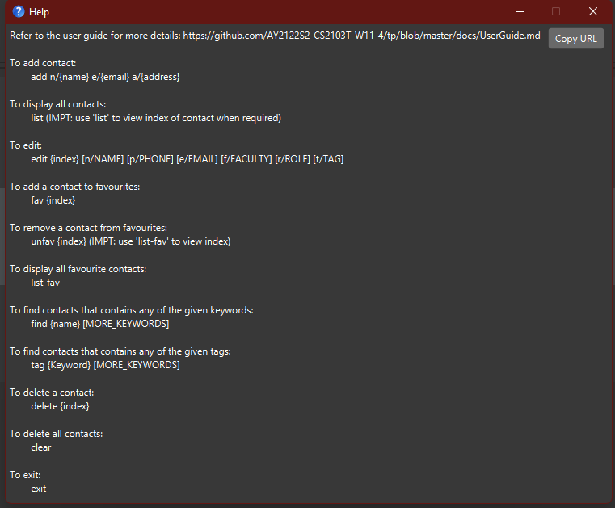

AddressBook Level 3 (AB3) is a **desktop app for managing contacts, optimized for use via a Command Line Interface** (CLI) while still having the benefits of a Graphical User Interface (GUI). If you can type fast, AB3 can get your contact management tasks done faster than traditional GUI apps.

<!-- TABLE OF CONTENTS -->

  
Table of Contents

  <ol>
    <li>
      <a href="#quick-start">Quickstart</a>
    </li>
    <li>
      <a href="#features">Features</a>
      <ul>
        <li><a href="#prerequisites">Viewing Help</a></li>
        <li><a href="#installation">Adding a person</a></li>
        <li><a href="#installation">Listing all contacts</a></li>
        <li><a href="#installation">Locating contacts by name</a></li>
        <li><a href="#installation">Locating contacts by tags</a></li>
        <li><a href="#installation">Listing favorite contacts</a></li>
        <li><a href="#installation">Add to favorite list</a></li>
        <li><a href="#installation">Remove from favorite list</a></li>
        <li><a href="#installation">Deleting a contact</a></li>
        <li><a href="#installation">Exiting the program</a></li>
      </ul>
    </li>
    <li>
        <a href="#getting-started">Future Features</a>
        <ul>
            <li><a href="#prerequisites">Filtering contacts: Mod, User name, Faculty, etc…</a></li>
            <li><a href="#prerequisites">Saving contacts to favourites</a></li>
            <li><a href="#prerequisites">Clearing the list</a></li>
            <li><a href="#prerequisites">Interacting with contact</a></li>
            <li><a href="#prerequisites">Addition of multiple modules and roles (eg /mod cs2030 cs2040)</a></li>
            <li><a href="#prerequisites">Improve on the delete feature to delete by name etc</a></li>
        </ul>
    </li>
  </ol>

## Quick start

1. Ensure you have Java `11` or above installed in your Computer.

1. Download the latest `addressbook.jar` from [here](https://github.com/se-edu/addressbook-level3/releases).

1. Copy the file to the folder you want to use as the _home folder_ for your NUSearch.

1. Double-click the file to start the app. The GUI similar to the below should appear in a few seconds. Note how the app contains some sample data. 
   

1. Type the command in the command box and press Enter to execute it. e.g. typing **`help`** and pressing Enter will open the help window. 
   Some example commands you can try:

   * **`list`** : Lists all contacts.

   * **`add`**`n/John Doe p/98765432 e/johnd@example.com a/John street, block 123, #01-01` : Adds a contact named `John Doe` to the NUSearch.

   * **`delete`**`3` : Deletes the 3rd contact shown in the current list.

   * **`clear`** : Deletes all contacts.

   * **`exit`** : Exits the app.

1. Refer to the [Features](#features) below for details of each command.

--------------------------------------------------------------------------------------------------------------------

## Features

* Words in `UPPER_CASE` are the parameters to be supplied by the user. 
  e.g. in `add n/NAME`, `NAME` is a parameter which can be used as `add n/John Doe`.

* Items in square brackets are optional. 
  e.g `n/NAME [t/TAG]` can be used as `n/John Doe t/friend` or as `n/John Doe`.

* Items with `…`​ after them can be used multiple times including zero times. 
  e.g. `[t/TAG]…​` can be used as ` ` (i.e. 0 times), `t/friend`, `t/friend t/family` etc.

* Parameters can be in any order. 
  e.g. if the command specifies `n/NAME p/PHONE_NUMBER`, `p/PHONE_NUMBER n/NAME` is also acceptable.

* If a parameter is expected only once in the command but you specified it multiple times, only the last occurrence of the parameter will be taken. 
  e.g. if you specify `p/12341234 p/56785678`, only `p/56785678` will be taken.

* Extraneous parameters for commands that do not take in parameters (such as `help`, `list`, `exit` and `clear`) will be ignored. 
  e.g. if the command specifies `help 123`, it will be interpreted as `help`.

### Viewing help : `help`

Shows a message explaning how to access the help page.

Format: `help`

### Adding a person: `add`

Adds a person to the contact list.

Format: `add n/NAME [p/PHONE_NUMBER] e/EMAIL [m/MODULE] f/FACULTY r/ROLE …​`

:bulb: **Tip:**
A person can have any number of module tags and phone numbers (including 0)

Examples:
* `add n/Shurvir Arora p/98765432 e/shurvir@example.com m/CS2103T f/computing r/professor`
* `add n/Betsy Crowe m/CS2103T e/betsycrowe@example.com m/CS2100 r/TA`

### Listing all persons : `list`

Displays all contacts in the contact list.

Format: `list`

### Editing a person : `edit`

Edits an existing person in the address book.

Format: `edit INDEX [n/NAME] [p/PHONE] [e/EMAIL] [m/MODULE] [f/FACULTY] [r/ROLE]…​`

* Edits the person at the specified `INDEX`. The index refers to the index number shown in the displayed person list. The index **must be a positive integer** 1, 2, 3, …​
* At least one of the optional fields must be provided.
* Existing values will be updated to the input values.
* When editing phone number and module tags, these existing tags will be removed i.e adding of tags is not cumulative.
* You can remove all the person’s phone numbers by typing `p/` and all modules by typing `m/` without 
    specifying any tags after it.

Examples:
* `edit 1 p/91234567 e/johndoe@example.com` Edits the phone number and email address of the 1st person to be `91234567` and `johndoe@example.com` respectively.
* `edit 2 n/Betsy Crower m/` Edits the name of the 2nd person to be `Betsy Crower` and clears all existing module tags.
* `edit 2 n/Betsy Crower p/` Edits the name of the 2nd person to be `Betsy Crower` and clears all existing phone numbers.

### Adding a person into favourite list : `fav`

Adds a person to the favorite list.

Format: `fav INDEX`

Examples:
* `fav 1`
* `fav 2`

### Removing a person from favourite list : `unfav`

Removes a person from the favorite list.

Format: `unfav INDEX`

Examples:
* `unfav 1`
* `unfav 2`

### Listing all favourite contacts : `list-fav`

Displays all favourite contacts in the contact list.
                   
Format: `list-fav`
        
### Format: `find <NAME> [MORE_KEYWORDS]`  

Finds contact whose names contain any of the given keywords.

te contacts in the contact list.

* The search is case-insensitive. e.g `shur` will match `Shur`
* The order of the keywords matter. e.g. `Wei En` will match `En Wei`
* Only the name is searched.
* Only full words will be matched e.g. `Jiamin` will not match `Jiaming`
* Persons matching at least one keyword will be returned (i.e. `OR` search).
  e.g. `Eug ene` will return `Eug in`, `Nal g ene`

Examples:
* `find John` returns `john` and `John Doe`

### Locating contacts by tags: tag

Finds contacts whose tags meet the search criteria.

Format: `tag <Keyword> [MORE_KEYWORDS]`
* The search is case-insensitive. e.g `shurvir` will match `Shurvir`
* Only tags are searched up

### Deleting a person : `delete`

Deletes a contact from the contact list by index.

Format: `delete <index>`

* Deletes the person at the specified `<index>`.
* The index refers to the index number shown in the displayed person list.
* The index **must be a positive integer** 1, 2, 3, …​

Examples:
* `list` followed by `delete 2` deletes the 2nd person in the address book.
* `find Betsy` followed by `delete 1` deletes the 1st person in the results of the `find` command.

### Clearing all entries : `clear`

Clears all entries from the address book.

Format: `clear`

### Exiting the program : `exit`

Exits the program.

Format: `exit`

### Saving the data

AddressBook data are saved in the hard disk automatically after any command that changes the data. There is no need to save manually.

### Editing the data file

AddressBook data are saved as a JSON file `[JAR file location]/data/addressbook.json`. Advanced users are welcome to update data directly by editing that data file.

:exclamation: **Caution:**
If your changes to the data file makes its format invalid, AddressBook will discard all data and start with an empty data file at the next run.

### Archiving data files `[coming in v2.0]`

_Details coming soon ..._

--------------------------------------------------------------------------------------------------------------------

## FAQ

**Q**: How do I transfer my data to another Computer? 
**A**: Install the app in the other computer and overwrite the empty data file it creates with the file that contains the data of your previous AddressBook home folder.

--------------------------------------------------------------------------------------------------------------------

## Command summary

| Action              | Format, Examples                                                                                                                                                 |
|---------------------|------------------------------------------------------------------------------------------------------------------------------------------------------------------|
| **Add**             | `add n/NAME [p/PHONE_NUMBER] e/EMAIL [m/MODULE] [f/FACULTY] [r/ROLE]…​`   e.g., `add n/James Ho p/22224444 e/jamesho@example.com m/CS2103, f/Computing, r/TA` |
| **Clear**           | `clear`                                                                                                                                                          |
| **Delete**          | `delete INDEX`  e.g., `delete 3`                                                                                                                              |
| **Favourite**       | `fav INDEX`  e.g., `fav 3`                                                                                                                                    |
| **Unfavourite**     | `unfav INDEX`  e.g., `unfav 3`                                                                                                                                |
| **Edit**            | `edit INDEX [n/NAME] [p/PHONE_NUMBER] [e/EMAIL] [a/ADDRESS] …​`  e.g.,`edit 2 n/James Lee e/jameslee@example.com`                                      |
| **Find**            | `find KEYWORD [MORE_KEYWORDS]`  e.g., `find James Jake`                                                                                                       |
| **List**            | `list`                                                                                                                                                           |
| **List Favourites** | `list-fav`                                                                                                                                                       |
| **Help**            | `help`                                                                                                                                                           |