NUSearch is a **desktop app for managing NUS staff contacts, optimized for use via a Command Line Interface** (CLI) while still having the benefits of a Graphical User Interface (GUI).  
If you can type fast, NUSearch can get your contact management tasks done faster than traditional GUI applications.

--------------------------------------------------------------------------------------------------------------------
## Introduction

 NUS students may find it tough to manage university related contacts. 
 Despite platforms such as Luminus that provides students with relevant contact information for modules, there is no dedicated system that is customised to assist students in maintaining their NUS contacts. 

> Examples of how NUSearch operates as a university specific contact list:
>1. Faculty and role are mandatory fields to be filled in to make sure that each contact has a given faculty and role.
>2. As NUS students and staff often use Telegram as a form a communication, there is an optional field to store each contact's telegram username.
>3. Each user is able to filter out their contacts based on faculty and role.

--------------------------------------------------------------------------------------------------------------------

<!-- TABLE OF CONTENTS -->

  
Table of Contents

  <ol>
    <li>
      <a href="#quick-start">Quickstart</a>
    </li>
    <li>
      <a href="#notes-before-use">Notes before use</a>
    </li>
    <li>
      <a href="#commands">Commands</a>
      

        
General Commands

            <ol>
                <li><a href="#exiting-the-program--exit">Exit NUSearch</a></li>
                <li><a href="#view-help--help">View Help Page</a></li>
            </ol>
        

      

        
Basic Commands

            <ol>
                <li><a href="#add-a-contact-add-">Add a contact</a></li>
                <li><a href="#clear-all-contacts--clear">Clear all contacts</a></li>
                <li><a href="#delete-a-contact--delete-">Delete a contact</a></li>
                <li><a href="#edit-a-contact--edit-">Edit a contact</a></li>
                <li><a href="#list-all-contacts--list">List all contacts</a></li>
                <li><a href="#undo-a-command--undo">Undo a command</a></li>
                <li><a href="#redo-a-command--redo">Redo a command</a></li>
            </ol>
        

        

            
Find Commands

                <ol>
                    <li><a href="#find-contacts-matching-all-keywords--find-">Find contacts matching ALL keywords</a></li>
                    <li><a href="#find-contacts-matching-any-keywords--find-wide-">Find contacts matching ANY keywords</a></li>
                    <li><a href="#find-contacts-by-tags-tag-">Find contacts by tags</a></li>
                </ol>
        

        

        
Favourite Commands

            <ol>
                <li><a href="#favourite-a-contact--fav-">Favourite a contact</a></li>
                <li><a href="#list-all-favourite-contacts--list-fav">List all favourite contacts</a></li>
                <li><a href="#unfavourite-a-contact--unfav-">Unfavourite a contact</a></li>
            </ol>
        

      

        
Copy Commands

            <ol>
                <li><a href="#copy-email-address--copy-email-">Copy a contact's email address</a></li>
                <li><a href="#copy-phone-number--copy-phone-">Copy a contact's phone number</a></li>
            </ol>
        

    </li>
    <li>
        <a href="#data-matters">Data matters</a>
        <ul>
            <li><a href="#saving-the-data">Saving the data</a></li>
            <li><a href="#editing-the-data-file">Editing the data file</a></li>
        </ul>
    </li>
    <li>
        <a href="#frequently-asked-questions-faq">Frequently Asked Questions (FAQ)</a>
        <ul>
        </ul>
    </li>
    <li>
        <a href="#command-summary">Command Summary</a>
        <ul>
        </ul>
    </li>
  </ol>

***

## Quick start:

1. Ensure that you have Java `11` or above installed in your Computer.

2. Download the latest `NUSearch.jar` from [here](https://github.com/AY2122S2-CS2103T-W11-4/tp/releases).

3. Copy the file to the folder you want to use to store NUSearch.

4. Double-click the file to start the app. The GUI (aka Screen) similar to the one below should appear in a few seconds.  

> :rainbow: **Colour Scheme:** NUSearch's colour scheme is blue and orange to match the university's traditional colours.

  <a href="https://github.com/AY2122S2-CS2103T-W11-4/tp">
    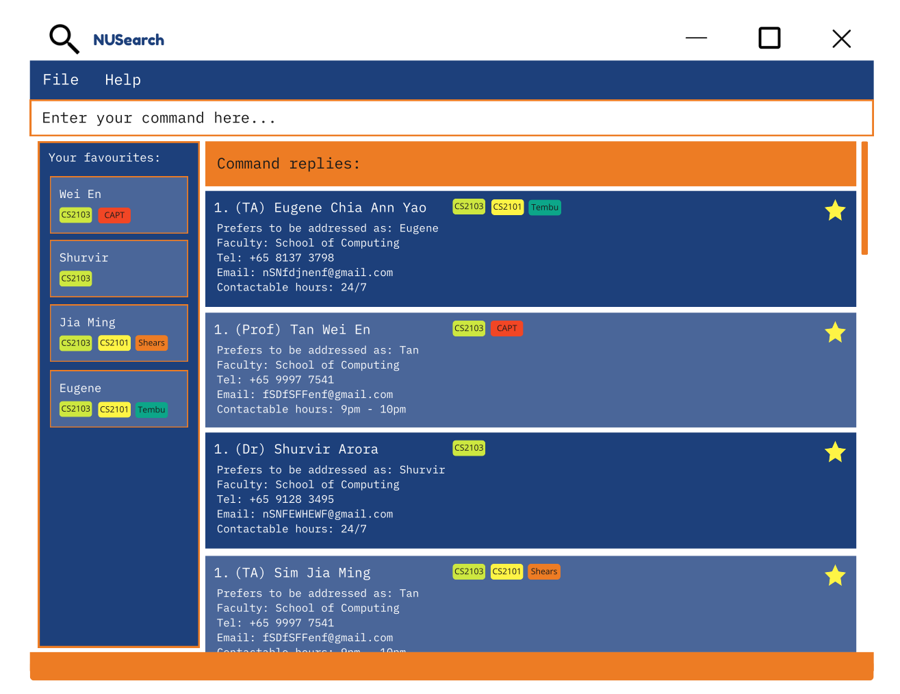
  </a>
  <h5 align="center">Figure 1. NUSearch home page</h5>

5. Type the command in the command box and press Enter to execute it. e.g. typing **`help`** and pressing Enter will open the help window. 

   > Some example commands you can try:

   > * **`list`** : Lists all contacts.
   > * **`add`**`n/John Doe p/98765432 e/johnd@example.com f/Computing r/Professor` : Adds a contact named `John Doe` to the NUSearch.
   > * **`delete`**`3` : Deletes the 3rd contact shown in the current list.
   > * **`clear`** : Deletes all contacts.
   > * **`exit`** : Exits the app.

_____________________________________________________

***

## Notes before use:

* Words in `UPPER_CASE` are the information to be supplied by the user. 
  e.g. in `add n/NAME`,
  > Example: `NAME` is a type of input which can be used as `add n/John Doe`.

* Items in square brackets are optional. 
  e.g `n/NAME [tele/USERNAME]`,
  > Example: `[tele/TELEGRAM]` is an optional input, hence`n/John Doe tele/@JohnDoe` and  `n/John Doe` are both valid commands.

* Items with `…`​ after them can be used multiple times or not at all (i.e zero times). 
  e.g. `[t/TAG]…​`,
  > Example: `[t/TAG]…​` can be used as ` ` (i.e. 0 times), `t/CS2103T`, `t/CS2103T t/friend` etc.

* Data being entered after the command can be in any order. 
  > Example: The command `add n/NAME p/PHONE_NUMBER e/EMAIL f/FACULTY r/ROLE` is the same as `add  p/PHONE_NUMBER n/NAME f/FACULTY e/EMAIL r/ROLE`.

* If the data entered is expected to be keyed in only once in the command, but you specified it multiple times, only the last occurrence of the data will be taken. 
  > Example: The Phone Number field only stores 1 phone number. Hence, if you entered 2 phone numbers `p/12341234 p/56785678`, only the last entry `p/56785678` will be stored.

* Extraneous input for commands that do not take in additional information (such as `help`, `list`, `exit` and `clear`) will be ignored. 
  > Example: if the command specifies `help 123`, it will be interpreted as `help`.

* Faculty and Role fields can **only** take the following values as input:

|  Faculty  |    Role    |
|:---------:|:----------:|
| Business  |   Admin    |
|    CDE    |  Lecturer  |
|    CHS    | Professor  |
| Computing | Researcher |
| Dentistry |     TA     |
|    Law    |   Tutor    |
| Medicine  |   Other    |
| Pharmacy  |
|   Music   |
|  Others   |

__________________________________________________________________________________________________________________________________

***

## Commands:

  
Command List

  <ol>
    

        
General Commands

            <ol>
                <li><a href="#exiting-the-program--exit">Exit NUSearch</a></li>
                <li><a href="#view-help--help">View Help Page</a></li>
            </ol>
        

      

        
Basic Commands

            <ol>
                <li><a href="#add-a-contact-add-">Add a contact</a></li>
                <li><a href="#clear-all-contacts--clear">Clear all contacts</a></li>
                <li><a href="#delete-a-contact--delete-">Delete a contact</a></li>
                <li><a href="#edit-a-contact--edit-">Edit a contact</a></li>
                <li><a href="#list-all-contacts--list">List all contacts</a></li>
                <li><a href="#undo-a-command--undo">Undo a command</a></li>
                <li><a href="#redo-a-command--redo">Redo a command</a></li>
            </ol>
        

        

            
Find Commands

                <ol>
                    <li><a href="#find-contacts-matching-all-keywords--find-">Find contacts matching ALL keywords</a></li>
                    <li><a href="#find-contacts-matching-any-keywords--find-wide-">Find contacts matching ANY keywords</a></li>
                    <li><a href="#find-contacts-by-tags-tag-">Find contacts by tags</a></li>
                </ol>
        

      

        
Favourite Commands

            <ol>
                <li><a href="#favourite-a-contact--fav-">Favourite a contact</a></li>
                <li><a href="#list-all-favourite-contacts--list-fav">List all favourite contacts</a></li>
                <li><a href="#unfavourite-a-contact--unfav-">Unfavourite a contact</a></li>
            </ol>
        

      

        
Copy Commands

            <ol>
                <li><a href="#copy-email-address--copy-email-">Copy a contact's email address</a></li>
                <li><a href="#copy-phone-number--copy-phone-">Copy a contact's phone number</a></li>
            </ol>
        

  </ol>

***

## General Commands

### Exiting the program : `exit`

Exits the program.

Format: `exit`

### View help : `help`

Shows a summative list of available commands for you to input.

  <a href="https://github.com/AY2122S2-CS2103T-W11-4/tp">
    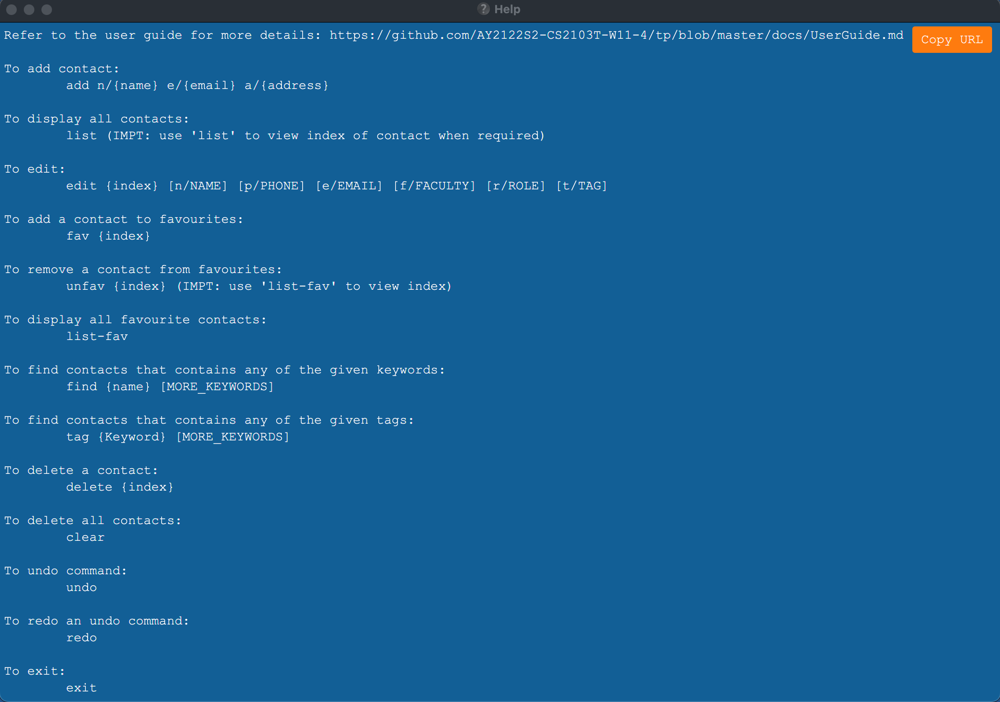
  </a>
  <h5 align="center">Figure 2. Help message screen</h5>

Format: `help`

> :bulb: **TIP:** Click on `Copy URL button to copy the link to our user guide.`

***

## Basic Commands

### Add a contact: `add ...`

Adds a contact to the contact list.

  <a href="https://github.com/AY2122S2-CS2103T-W11-4/tp">
    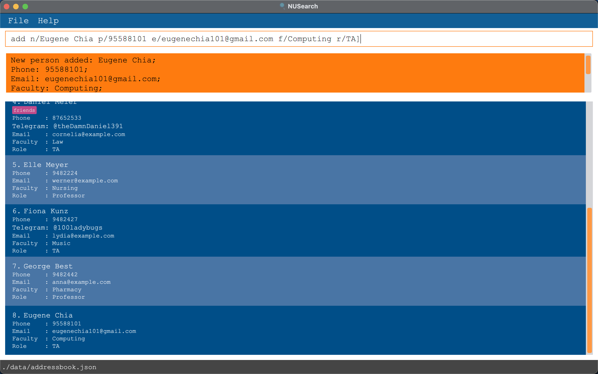
  </a>
  <h5 align="center">Figure 3. Add a contact</h5>

Format: `add n/NAME p/PHONE_NUMBER e/EMAIL f/FACULTY r/ROLE [tele/TELEGRAM] [t/TAG]…​`

> :spiral_notepad: **NOTE:** When adding faculty and role of a contact, only the following [values](#acceptable-values) are accepted as input.
>
> :bulb: **TIP:** A contact can have any number of tags, or none at all.

Examples:
* `add n/Shurvir Arora p/98765432 e/shurvir@example.com f/Computing r/Professor`
* `add n/Betsy Crowe p/98193898 e/betsycrowe@example.com f/Law r/TA tele/@BetsyCrowe t/CS2103T t/Friend`

***

### Clear all contacts : `clear`

Clears all contacts from the NUSearch database.

Format: `clear`

> :exclamation: **CAUTION:** This command clears **ALL** contacts in the NUSearch database!
>
> :bulb: **TIP:** Accidentally cleared the database? Don't worry, checkout our <a href="#undo-a-command--undo">undo</a> function!

### Delete a contact : `delete ...`

Deletes a contact from the contact list by an index.

  <a href="https://github.com/AY2122S2-CS2103T-W11-4/tp">
    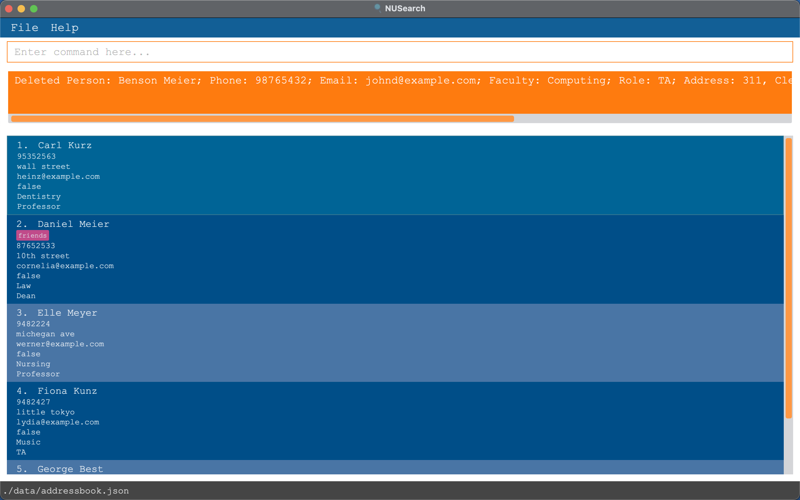
  </a>
<h5 align="center">Figure 4. Delete a contact</h5>

* Deletes the person at the specified `INDEX`.
* The index refers to the index number shown in the displayed person list.
* The index **must be a positive integer** 1, 2, 3, …​

Format: `delete INDEX`

> :bulb: **TIP:** Accidentally deleted the wrong contact? Don't worry, checkout our <a href="#undo-a-command--undo">undo</a> function!

Examples:
* `delete 2` deletes the 2nd person in the current displayed list.
* `find Betsy` followed by `delete 1` deletes the 1st person in the results of the `find` command.

### Edit a contact : `edit ...`

Edits an existing contact in NUSearch database.

  <a href="https://github.com/AY2122S2-CS2103T-W11-4/tp">
    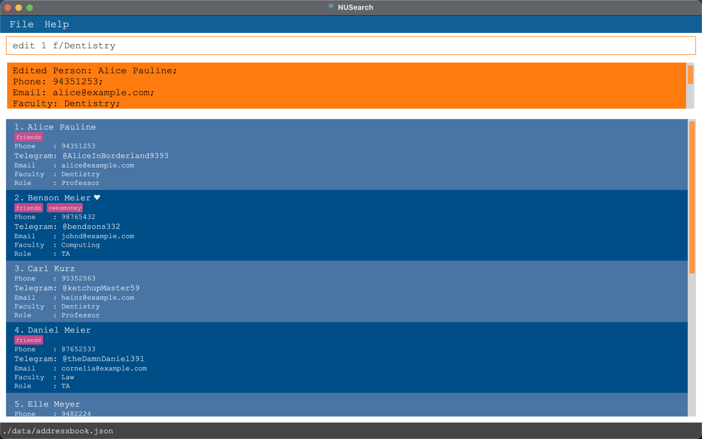
  </a>
<h5 align="center">Figure 5. Edit a contact's information</h5>

* Edits the person at the specified `INDEX`. The index refers to the index number shown in the displayed person list. The index **must be a positive integer** 1, 2, 3, …​
* Existing values will be updated according to the input values.
* When editing tags, the existing tags will be removed i.e adding of tags is not cumulative.
* You can remove all the person’s tags by typing `t/` without specifying any tags after it.

Format: `edit INDEX [n/NAME] [p/PHONE] [e/EMAIL] [f/FACULTY] [r/ROLE] [tele/TELEGRAM] [t/TAG]…​`

> :spiral_notepad: **NOTE:** When editing the faculty and role of a contact, only the following [values](#acceptable-values) are accepted as input.
>
> :bulb: **TIP:** The edit command allows you to edit multiple fields of a single contact in one command.

Examples:
* `edit 1 p/91234567 e/johndoe@example.com` Edits the phone number and email address of the 1st contact in the current displayed list to be `91234567` and `johndoe@example.com` respectively.
* `edit 2 n/Betsy Crower t/` Edits the name of the 2nd contact in the current displayed list to be `Betsy Crower` and clears all existing tags.
* `edit 3 f/Computing r/TA` Edits the faculty of the 3rd contact in the current displayed list to be `Computing` and role to be `TA`
* `edit 1 tele/@hackerway101` Edits the Telegram username of the 1st contact in the current displayed list to `@hackerway101`

***

### List all contacts : `list`

Displays all contacts in the contact list.

  <a href="https://github.com/AY2122S2-CS2103T-W11-4/tp">
    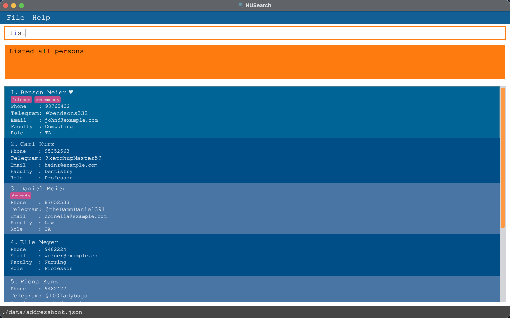
  </a>
<h5 align="center">Figure 6. List all contacts</h5>

Format: `list`

> :spiral_notepad: **NOTE:** Contacts listed will be sorted according to the time of addition.

***

### Undo a command : `undo`

Undo a command that was entered previously.

  <a href="https://github.com/AY2122S2-CS2103T-W11-4/tp">
    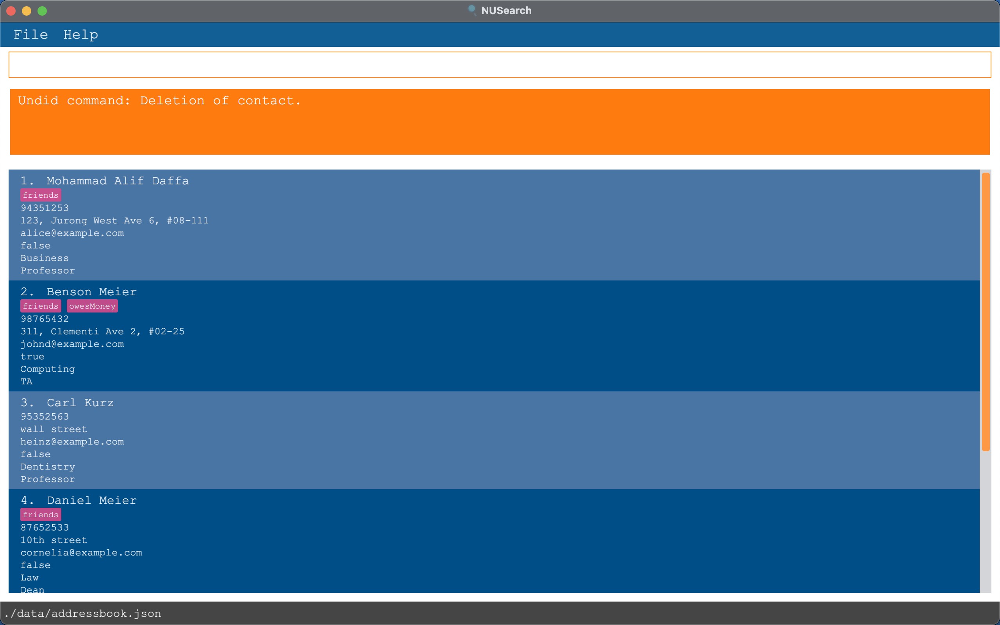
  </a>
<h5 align="center">Figure 7. Undo a delete command</h5>

Format: `undo`

> :bulb: **TIP:** This function only works if there are commands to undo.
>
> :spiral_notepad: **NOTE:** If no command has been previously entered, the undo command will not work.
> `Undo` does not work on `copy-email` and `copy-phone` commands.

Examples:
* `If you just added a person named John Doe, you can simply revert that action by keying in "undo".`
* `If you just deleted a person named Jessica Tan, you can simply revert that action by keying in "undo".`

***

### Redo a command : `redo`

Redo a command that was previously done.

  <a href="https://github.com/AY2122S2-CS2103T-W11-4/tp">
    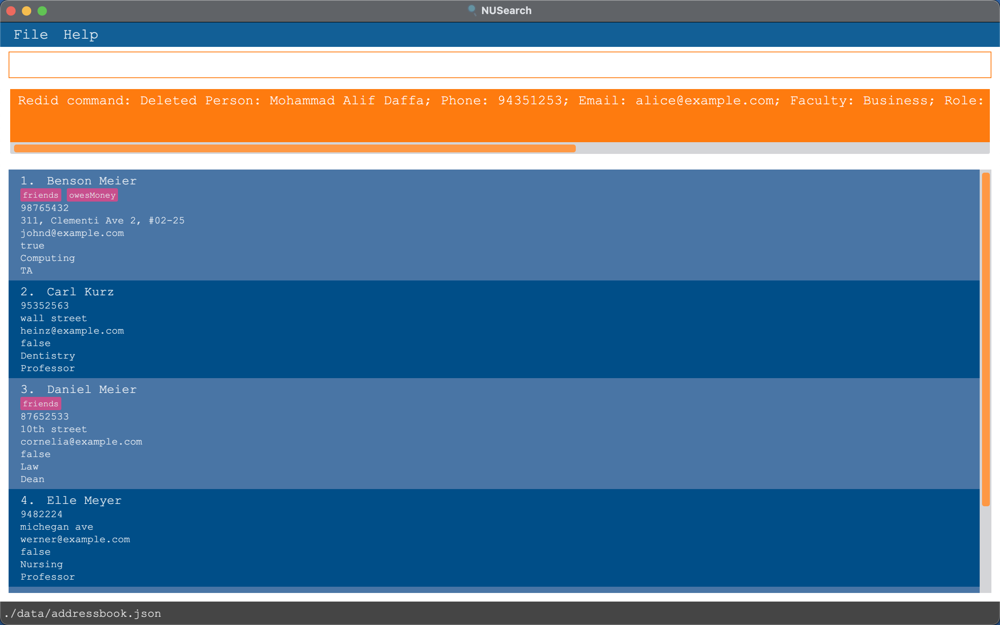
  </a>
<h5 align="center">Figure 8. Redo a delete command</h5>

Format: `redo`

> :bulb: **TIP:** This function only works if there are commands to redo.
>
> :spiral_notepad: **NOTE:** The “redo” command is the inverse of the “undo” command. It redoes an action that was undone.
> This is valuable if you accidentally execute the "undo" command too many times.
> `Redo` does not work on `copy-email` and `copy-phone` commands.

Examples:
* `If you just added a person named John Doe, proceeded to undo that action, and then perform the "redo" command, the person John Doe will still be added as a contact.`

***

## Find Commands

### Find contacts matching **ALL** keywords : `find ...`

Find contacts that contain **ALL** the given keywords.

  <a href="https://github.com/AY2122S2-CS2103T-W11-4/tp">
    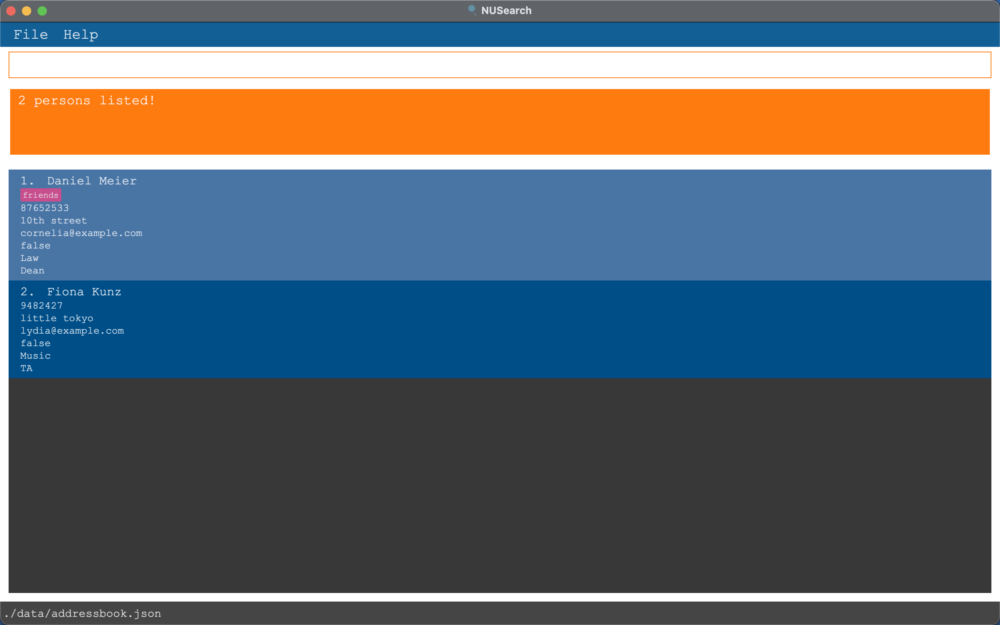
  </a>
<h5 align="center">Figure 9. Finding contacts with the keywords Daniel and TA </h5>

* Keywords can match names, faculty, role e.g. `Computing` will return all contacts with `Computing` in either their name, faculty or role field.
* The search is case-insensitive. e.g `shur` will match `Shur`
* The order of the keywords do not matter. e.g. `Wei En` will match `En Wei`
* Only full words will be matched e.g. `Jiamin` will not match `Jiaming`
* Only persons matching **ALL** keywords will be returned e.g. `find David Computing` will only return contacts with `David` **AND** `Computing` as part of their keywords.

Format: `find KEYWORD [MORE_KEYWORDS]`

> :bulb: **TIP:** Use more keywords if you want to **narrow** your search down to a specific contact.

Examples:
* `find John` returns `john` and `John Doe`
* `find John Doe` returns `John Doe Lee`, `John Loo Doe` but not `John Moo`
* `find David Computing` returns `David` from `Computing` but not `David` from `Business`
* `find David Professor` returns contacts with the name `David` **and** have `Professor` as their role.

### Find contacts matching **ANY** keywords : `find-wide ...`

Find contacts that contain **ANY** the given keywords.

  <a href="https://github.com/AY2122S2-CS2103T-W11-4/tp">
    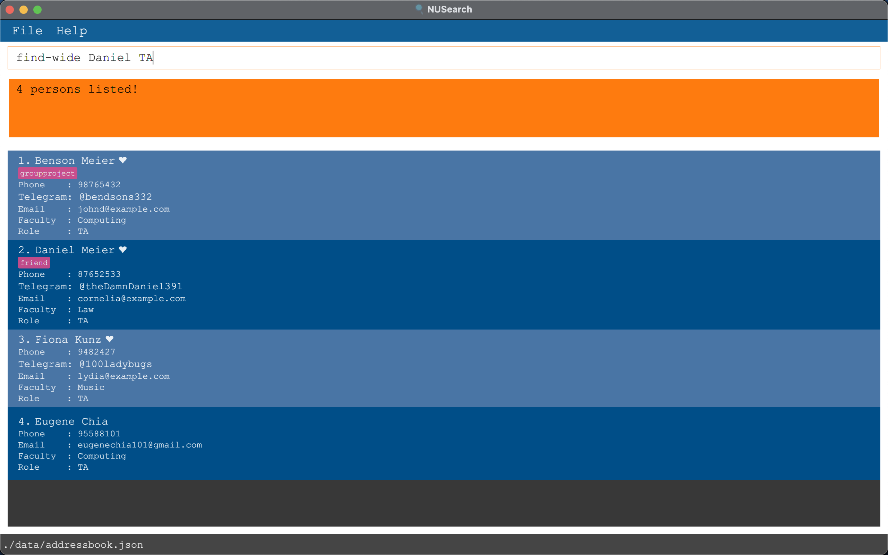
  </a>
<h5 align="center">Figure 10. Finding contacts with the keywords Daniel and TA </h5>

* Keywords can match names, faculty, role e.g. `Computing` will return all contacts with `Computing` in either their name, faculty or role field.
* The search is case-insensitive. e.g `shur` will match `Shur`
* The order of the keywords do not matter. e.g. `Wei En` will match `En Wei`
* Only full words will be matched e.g. `Jiamin` will not match `Jiaming`
* Persons matching at least one keyword will be returned e.g. `find-wide Eug ene` will return `Eug in`, `Nal g ene` and `ene eug`

Format: `find-wide KEYWORD [MORE_KEYWORDS]`

> :bulb: **TIP:** Use more keywords if you want to **broaden** your search range.

Examples:
* `find-wide John` returns `john` and `John Doe`
* `find-wide John Doe` returns `John Doe Lee`, `John Loo Doe` and `John Moo`
* `find-wide David Computing` returns **ALL** contacts with the name `David` **or** are from `Computing`
* `find-wide David Professor` returns **ALL** contacts with the name `David` **or** have `Professor` as their role

### Find contacts by tags: `tag ...`

Find contacts whose attributed tags meet the given keywords.

  <a href="https://github.com/AY2122S2-CS2103T-W11-4/tp">
    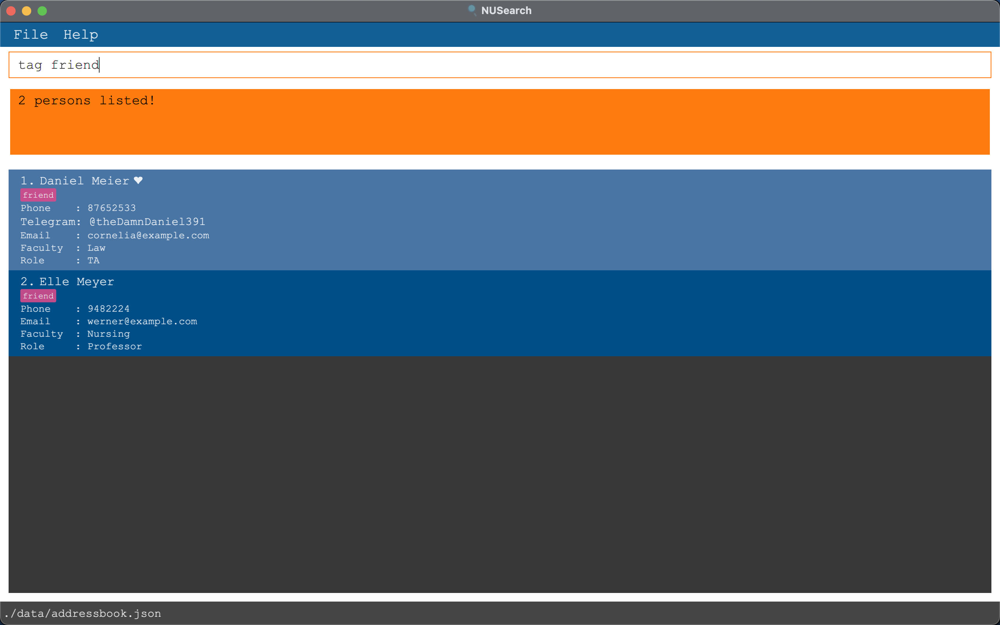
  </a>
<h5 align="center">Figure 11. Finding contacts with the 'friend' tag</h5>

* The search is case-insensitive. e.g `colleague` will match `Colleague`
* Only tags are included in the search, other fields are ignored.

Format: `tag TAG [MORE_TAGS]`

> :bulb: **TIP:** Attaching tags to a contact is a way for you to attach your own meaning to the contact.
>
>For example, adding the `CS2103T` tag to your professor's contact to indicate that this professor teaches the `CS2103T` module.

Examples:
* `tag CS2103T` Lists all contacts in the current displayed list that have the `CS2103T` tag.
* `tag colleague bestie` Lists all contacts in the current displayed list that have the `colleague` or `bestie` tag.

***

## Favourite Commands

### Favourite a contact : `fav ...`

Adds a contact to the favorite list.

  <a href="https://github.com/AY2122S2-CS2103T-W11-4/tp">
    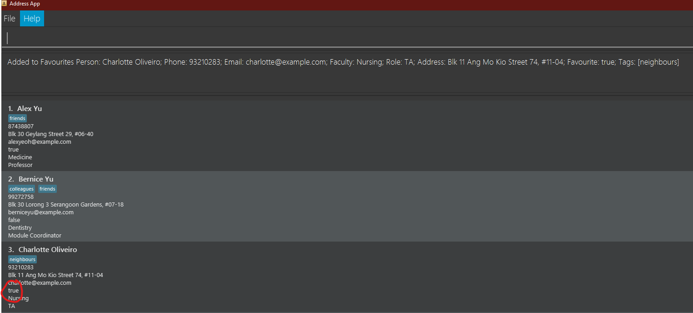
  </a>
<h5 align="center">Figure 12. Favourite contact</h5>

Format: `fav INDEX`

> :bulb: **TIP:** Use this function on contacts that you view frequently!

Examples:
* `fav 1` adds the 1st contact in the current displayed list to the favourites list.
* `fav 2` adds the 2nd contact in the current displayed list to the favourites list.

***

### List all favourite contacts : `list-fav`

Displays all favourite contacts in the contact list.

  <a href="https://github.com/AY2122S2-CS2103T-W11-4/tp">
    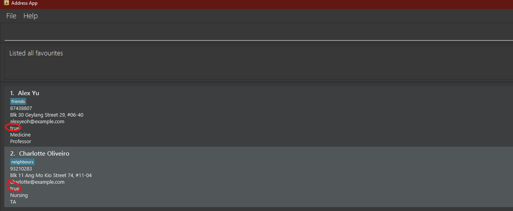
  </a>
<h5 align="center">Figure 13. List favourite contacts</h5>

Format: `list-fav`

***

### Unfavourite a contact : `unfav ...`

Removes a contact from the favorite list.

  <a href="https://github.com/AY2122S2-CS2103T-W11-4/tp">
    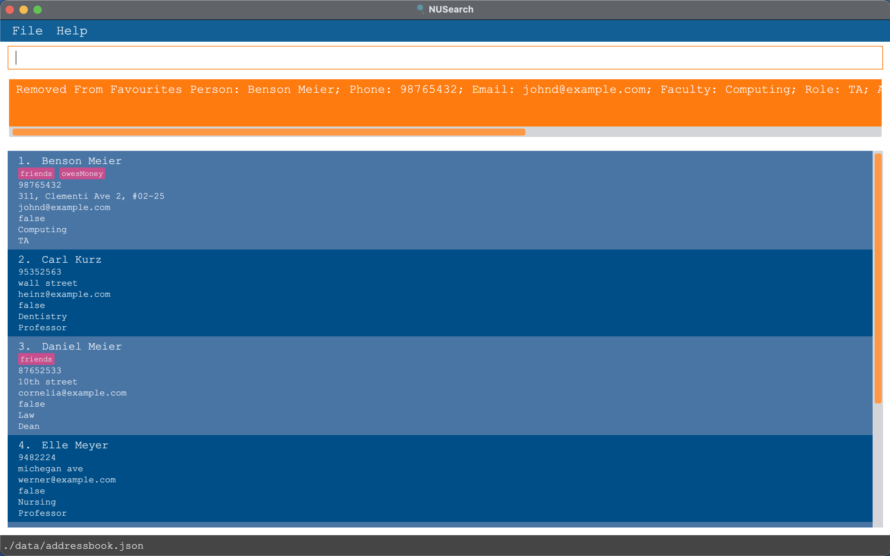
  </a>
<h5 align="center">Figure 14. Favourite contact</h5>

Format: `unfav INDEX`

Examples:
* `unfav 1` unfavourites the 1st contact from the current displayed list.
* `unfav 2` unfavourites the 2nd contact from the current displayed list.

***

## Copy Commands

### Copy email address : `copy-email ...`

Copies a contact's email address to your clipboard.

  <a href="https://github.com/AY2122S2-CS2103T-W11-4/tp">
    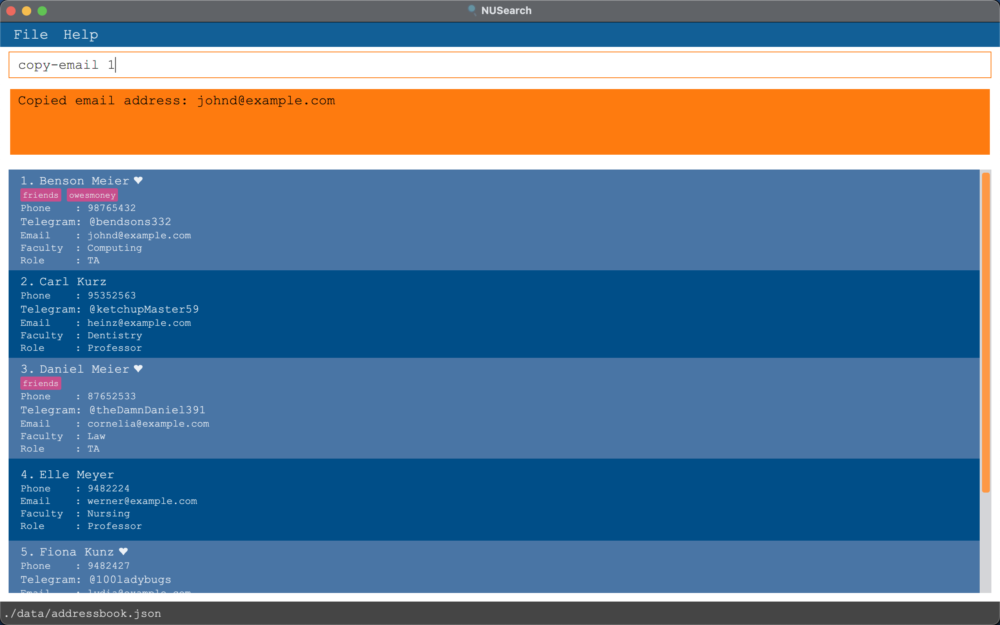
  </a>
<h5 align="center">Figure 15. Copy a contact's email address</h5>

* Copies the email address of the contact at the specified `INDEX`.
* The index refers to the index number shown in the displayed person list.
* The index **must be a positive integer** 1, 2, 3, …​

Format: `copy-email INDEX`

> :bulb: **TIP:** You can paste the copied email into any text field using the shortcut key combination `Ctrl + V` on a PC or `Command + V` on a Mac.

Examples
* `copy-email 1  will copy the  email of the contact at index 1.`
* `copy-email 4  will copy the  email of the contact at index 4.`

***

### Copy phone number : `copy-phone ...`

Copies a contact's phone number to your clipboard.

  <a href="https://github.com/AY2122S2-CS2103T-W11-4/tp">
    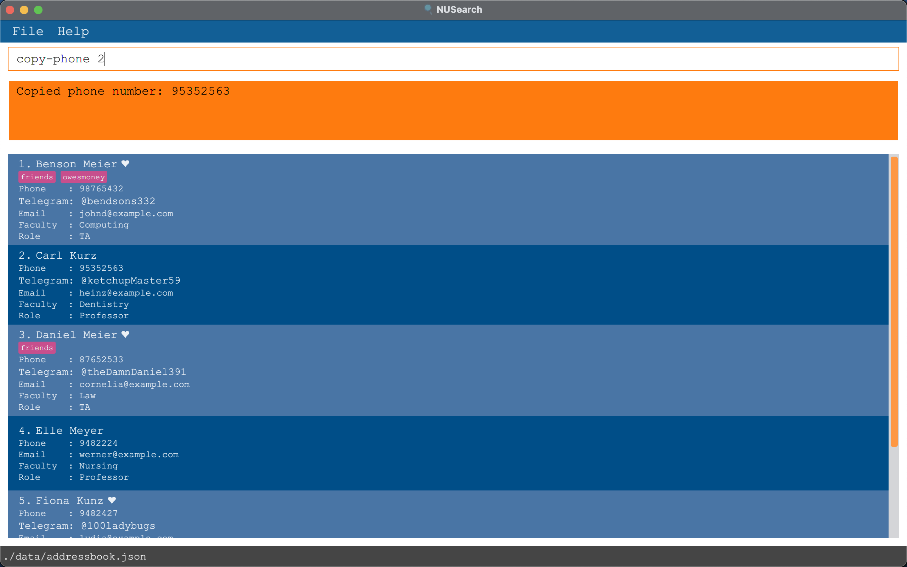
  </a>
<h5 align="center">Figure 16. Copy a contact's phone number</h5>

* Copies the phone number of the contact at the specified `INDEX`.
* The index refers to the index number shown in the displayed person list.
* The index **must be a positive integer** 1, 2, 3, …​

Format: `copy-phone INDEX`

> :bulb: **TIP:** You can paste the copied phone number into any text field using the shortcut key combination `Ctrl + V` on a PC or `Command + V` on a Mac.

Examples
* `copy-phone 1  will copy the  phone number of the contact at index 1.`
* `copy-phone 4  will copy the  phone number of the contact at index 4.`

______________________________________________________________________

***

## Data Matters:

### Saving the data

NUSearch data are saved in the hard disk automatically after any command that changes the data. There is no need to save manually.

### Editing the data file

NUSearch data are saved as a JSON file `[JAR file location]/data/NUSearch.json`. Advanced users are welcome to update data directly by editing that data file.

> :exclamation: **CAUTION:** If your changes to the data file makes its format invalid, NUSearch will discard all data and start with an empty data file at the next run.

______________________________________________________________________________________

## Frequently Asked Questions (FAQ)
**Q**: Is my data private?  
**A**: Your data is not saved online and is only accessible by you.

**Q**: How do I transfer my data to another Computer? 
**A**: Install the app in the other computer and overwrite the empty data file it creates with the file that contains the data of your previous NUSearch home folder.

**Q**: How do I report a bug?  
**A**: You can create an `Issue` on our team's Github page [here](https://github.com/AY2122S2-CS2103T-W11-4/tp/issues).

--------------------------------------------------------------------------------------------------------------------

***

## Command Summary

### Category: General Commands

The following commands can be used in any context and are for general purposes.

| Function                     | Format Of Command |
|------------------------------|-------------------|
| **Exit the program**         | `exit`            |
| **Display help page pop-up** | `help`            |

### Category: Basic Commands

The following commands are used in dealing with contacts.

| Function                          | Format Of Command                                                              |
|-----------------------------------|--------------------------------------------------------------------------------|
| **Add a new contact**             | `add n/NAME p/PHONE_NUMBER e/EMAIL f/FACULTY r/ROLE [tele/TELEGRAM] [t/TAG]…​` |
| **Clear all contacts**            | `clear`                                                                        |
| **Delete an existing contact**    | `delete INDEX`                                                                 |
| **Edit an existing contact**      | `edit INDEX [n/NAME] [p/PHONE_NUMBER] [e/EMAIL] [tele/TELEGRAM] [t/TAG]…​`     |
| **List all contacts**             | `list`                                                                         |
| **Undo previous commands**        | `undo`                                                                         |
| **Redo commands**                 | `redo`                                                                         |

***

### Category: Find Commands

The following commands are used in dealing with finding contacts.

| Function                                    | Format Of Command                   |
|---------------------------------------------|-------------------------------------|
| **Find contact(s) matching ALL keywords**   | `find KEYWORD [MORE_KEYWORDS]`      |
| **Find contact(s) matching ANY keywords**   | `find-wide KEYWORD [MORE_KEYWORDS]` |
| **Find contact(s) by tags**                 | `tag TAG`                           |

> :spiral_notepad: **NOTE:** KEYWORD refers to either NAME, ROLE or FACULTY

### Category: Favourite Commands

The following commands are used in dealing with favourite contacts.

| Function                    | Format Of Command |
|-----------------------------|-------------------|
| **Favourite a contact**     | `fav INDEX`       |
| **List favourite contacts** | `list-fav`        |
| **Unfavourite a contact**   | `unfav INDEX`     |

### Category: Copy Commands

The following commands are used in dealing with copying information of contacts.

| Function          | Format Of Command           |
|-------------------|-----------------------------|
| **Copy Email**    | `copy-email INDEX`          |
| **Copy Phone**    | `copy-phone INDEX`          |

<!-- PROJECT LOGO -->
 

<h3 align="center">NUSearch</h3>

  

    A GUI application to help you manage your university contacts!
     
    <a href="https://github.com/AY2122S2-CS2103T-W11-4/tp"><strong>Explore the docs »</strong></a>
     
     
    <a href="https://github.com/AY2122S2-CS2103T-W11-4/tp/releases">View Demo</a>
    ·
    <a href="https://github.com/AY2122S2-CS2103T-W11-4/tp/issues">Report Bug</a>
    ·
    <a href="https://github.com/AY2122S2-CS2103T-W11-4/tp/issues">Request Feature</a>
  

